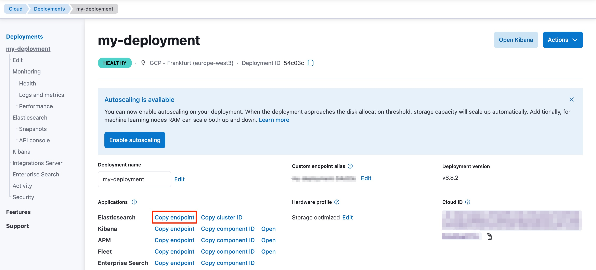
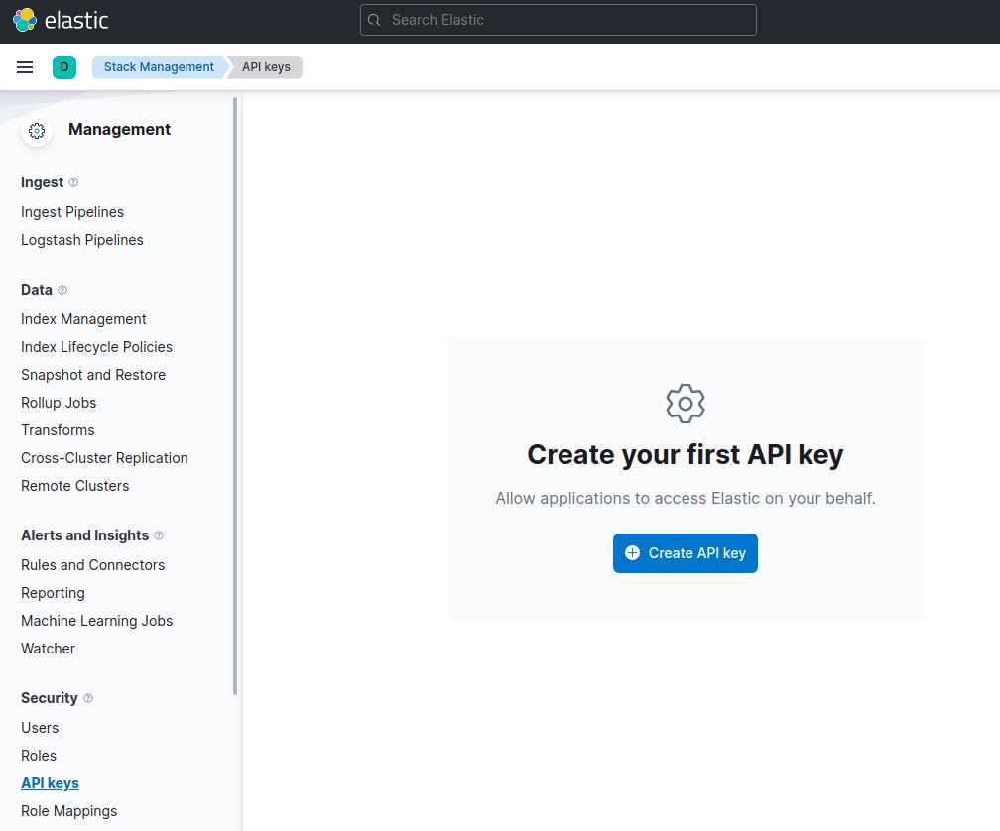

#

### 참고사이트
📒 [Elastic Search 공식 문서](https://www.elastic.co/docs/reference/elasticsearch/clients/java/getting-started)

---

### 요구조건
- Java 17 이상

### 설치

<details>
<summary>Gradle</summary>

```gradle
dependencies {
    implementation 'co.elastic.clients:elasticsearch-java:9.0.0'
}
```

</details>

<details>
<summary>Maven</summary>

```html
<project>
  <dependencies>

    <dependency>
      <groupId>co.elastic.clients</groupId>
      <artifactId>elasticsearch-java</artifactId>
      <version>9.0.0</version>
    </dependency>

  </dependencies>
</project>
```
</details>

### Java 연결
[1] `serverUrl`은 `My deployment` 페이지에서 확인할 수 있다.


[2] `apiKey`는 `Management` 페이지에서 생성할 수 있다.


[3] 다른 연결 설정들은 👉 [연결설정](https://www.elastic.co/docs/reference/elasticsearch/clients/java/setup/connecting) 확인

[4] Java → ES 연결하는 코드
```java
// URL and API key
String serverUrl = "https://localhost:9200";
String apiKey = "VnVhQ2ZHY0JDZGJrU...";

ElasticsearchClient esClient = ElasticsearchClient.of(b -> b
    .host(serverUrl)
    .apiKey(apiKey)
);

// Use the client...

// Close the client, also closing the underlying transport object and network connections.
esClient.close();
```

### Java API

📒 [Java Client API 공식 문서](https://www.elastic.co/docs/reference/elasticsearch/clients/java/usage/)

#### 인덱스 생성 방법
```java
esClient.indices().create(c -> c
    .index("products")
);
```

#### 문서 인덱싱

```java
Product product = new Product("bk-1", "City bike", 123.0);

IndexResponse response = esClient.index(i -> i
    .index("products")
    .id(product.getSku())
    .document(product)
);

logger.info("Indexed with version " + response.version());
```

### 문서 id로 조회

```java
GetResponse<Product> response = esClient.get(g -> g
    .index("products")  // products 인덱스에서
    .id("bk-1"),        // id 값이 'bk-1'인 문서 조회
    Product.class
);

if (response.found()) {
    Product product = response.source();
    logger.info("Product name " + product.getName());
} else {
    logger.info ("Product not found");
}
```

### 문서 필드로 조회
```java
String searchText = "bike";

SearchResponse<Product> response = esClient.search(s -> s
        .index("products")  // products 인덱스에서
        .query(q -> q
            .match(t -> t
                .field("name")  // 'name'필드의 값이
                .query(searchText)  // searchText와 일치하는 문서 조회
            )
        ),
    Product.class
);
```

### 문서 Upsert
- upsert : id에 해당하는 문서가 존재하면 update, 없으면 insert
```java
Product product = new Product("bk-1", "City bike", 123.0);

esClient.update(u -> u
        .index("products")  // products 인덱스에서
        .id("bk-1")         // 'bk-1' id와 일치하는 문서에
        .upsert(product),   // upsert
    Product.class
);
```

### 문서 삭제
```java
esClient.delete(d -> d.index("products").id("bk-1"));
```

### 인덱스 삭제
```java
esClient.indices().delete(d -> d
    .index("products")
);
```