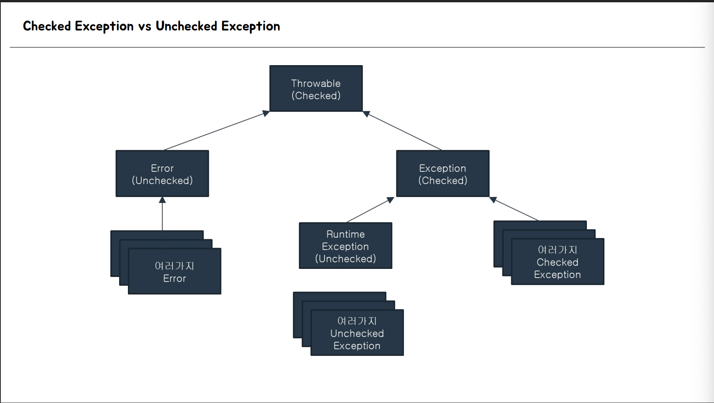
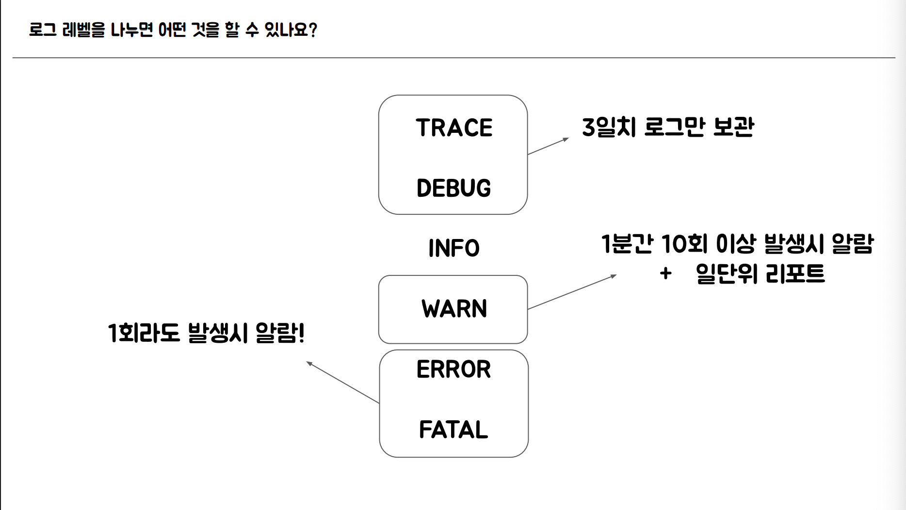
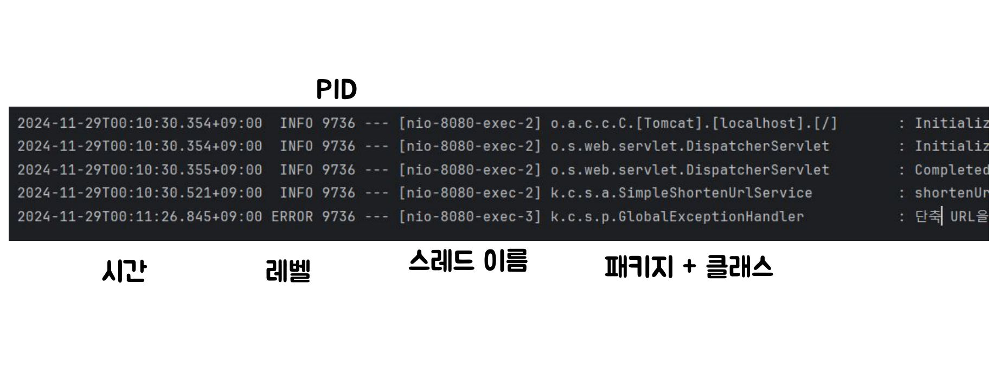
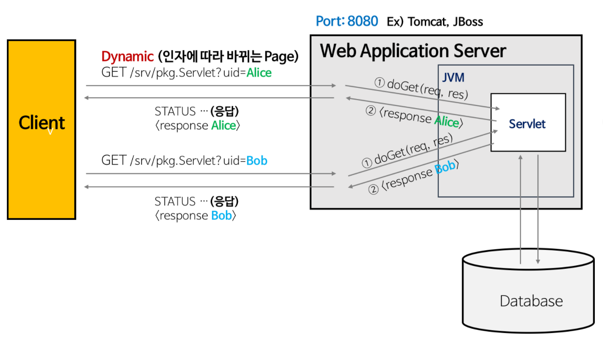
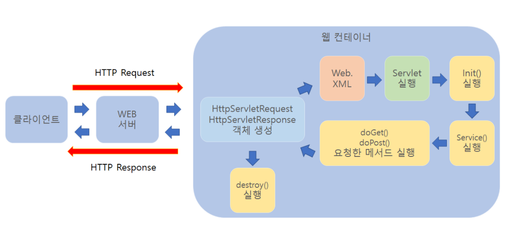
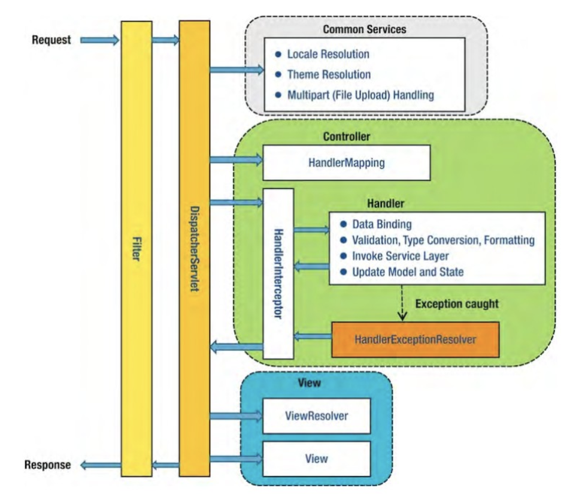

# 로그 있어서 가능한 일들

1. 운영하다가 장애가 발생했는지 로그를 통해 체크
2. 장애 발생시 문제 해결을 위한 힌트 제공
    
    → 로그 분석을 통해 반복적으로 실수가 발생하는 프로세스를 변경
    
    → 장애 상황을 해결하기 위해서는 개발자가 동일한 데이터로 동일한 상황을 로컬 개발 환경에서 재현해 보는 것이 중요한데 이를 로그가 도와줄 수 있다.
    
3. CS(고객문의)가 들어와 서비스에서 처리된 데이터 확인
4. 개인정보를 다루는 서비스나 금융 관련 서비스에서는 법적으로 로그를 남겨야 하는 경우도 있음

---

트러블 슈팅에 도움이 될 것 같은 로그를 남긴다!

- 서비스 특성에 따라 달라진다.

https://github.com/lleellee0/shorten-url-for-logging

- `sout` 는 실무에서 권장되지 않는다.

### 1. 요청/응답 로그

- 사용자가 어떤 요청을 보냈고, 시스템이 어떻게 응답했는지를 기록

### 2. 오류 및 예외 로그

- 시스템에서 발생한 오류와 예외 상황을 기록하여 디버깅에 활용.

### 3. 사용자 활동 로그

- 사용자 행동 기록을 토애 서비스 이용 흐름 및 보안 감사 추적.

### 4. 시스템 상태 로그

- 애플리케이션 및 서버의 상태를 지속적으로 모니터링.
- 애플리케이션 레이어에서는 굳이 남기지 않는다.
- 별도로 APM을 사용하여 모니터링 하는게 더 일반적이다.

### 5. 데이터베이스 쿼리 로그

- 느린 쿼리와 비정상적인 데이터베이스 사용 탐지
- 애플리케이션 단계에서 로그를 남기는 것은 지양. (지금 회사는 남기고 있는데.. 나중에 강의 다 듣고 생각해보자)

### 6. 배치 및 스케줄 작업 로그

- 배치 작업 및 백그라운드 프로세스의 실행 상태 기록
- 현재 실패시 문자가 오도록 사용하고 있음.

---

# Checked Exception과 Unchecked Exception의 차이

## ❌ 올바르지 못한 답변

Checked Exception은 컴파일 할 때 발생하고, Unchecked Exception은 런타임에 발생한다.

→ Exception은 모두 런타임 시점에만 발생한다. 컴파일 시점에는 Exception이 발생하지 않는다!

→ 컴파일 시점에 발생하는 건 예외가 아니라 문법적인 오류 때문에 발생하는 컴파일 에러다.

## ⭕️ 올바른 답변

Checked Exception은 컴파일 할 때 Exception에 대한 처리를 강제하고, Unchecked Exception은 Exception에 대한 처리를 강제하지 않는다.

→ Exception에 대한 강제 처리의 의미는 Exception이 발생할 경우에 대해 **`try-catch`**문으로 감싸거나 **`throws`**를 통해 메서도 밖으로 Exception을 던지는 것을 강제한다는 의미이다.

---

## 생성 방법

### Checked Exception

```java
public class CheckedException extends Exception { }
```

### Unchecked Exception

```java
public class UncheckedException extends RuntimeException { }
```

---

## 구조



---

## Error

- Error는 발생하는 것 자체를 방지하는 방향으로 프로그램을 설계해야 한다.
- out-of-memory, stack overflow, …

---

# Checked Exception과 Unchecked Exception 중 어떤 예외를 사용해야할까?

- 사용자 정의 Exception을 만들 때, Unchecked Exception으로 생성하는 것을 권장한다.

→ Checked Exception으로 처리할 경우, Exception이 발생한 메소드에 `try-catch` 처리를 하거나, 최상위 메소드까지 모두 `throws` 처리를 해야한다.(즉, 불필요한 작업이 발생한다.)

→ HTTP 요청이 들어온 컨트롤러까지 무조건 이 예외가 전달되어야 하는 상황에서는 Unchecked Exception이 훨신 좋다.

→ 대부분 Exception 핸들링을 해야 되는 상황들은 Unchecked Exception이 좀 더 유용한 경우가 많다.

→ 반대로, 로직 내에서 Exception을 핸들링할 수 있는 방법이 명확히 있는 경우 즉, Exception을 바깥으로 다시 던져 줄 필요가 없는 경우엔 Checked Exception을 사용하는 것이 더 유용하다.

---

# 로그 레벨을 나누면 어떤 것을 할 수 있나요?



- 로그 레벨 별로 로그를 따로 관리할 수 있게 된다.
- `바퀴를 재발명하지 말라`
- 이미 잘 만들어지고 나뉘어진 로그 레벨을 활용해라.

---

## 로그 레벨 각각의 의미

### TRACE

가장 세부적인 수준의 로그로, 코드의 세부적인 실행 경로를 추적할 때 사용

- Request Body의 전부를 기록
- 성능 측정을 위한 메서드 실행 시간 기록
- 엄청 많은 양이 발생하여 저장 공간을 많이 차지하기 때문에 적절히 처리하는 것이 중요
- 3일만 로그를 보관하는 이유도 위와 같다.

### DEBUG

디버깅 목적의 로그로, 개발 중 코드의 상태나 흐름을 이해하기 위해 사용

- 서비스 개발 과정에서 주요하게 찍어야 되는 값들을 기록
- 특정 조건에서 발생하는 버그가 존재한다면, 그 버그가 자주 발생하는 건 아니고 종종 발생하는 거라면 의심되는 지점에 기록

### INFO

시스템의 정상적인 운영 상태를 나타내는 정보성 로그로, 중요한 이벤트나 상태 변화를 기록

- 오류 상황은 아니면서도, 시스템에서 주요한 기능의 실행 혹은 비즈니스 로직 실행 결과 같은 걸 기록

### WARN

잠재적으로 문제가 될 수 있는 상황을 나타내지만, 시스템 운영에는 즉각적인 영향을 주지 않는 경우 사용

- 현재는 30ms, 점점 느려져 나중에 60ms가 되었을 때 개발자에게 알림이 오도록.. 즉, 지금 당장은 관리할 필요는 없지만, 문제를 인지하고 있고 차후에 수정이 필요한 경우를 위해 기록

### ERROR

치명적이지 않지만, 중요한 문제가 발생했음을 나타냅니다. 복구가 필요하거나 실패한 작업을 추적해야 할 때 사용

- 보통 장애 상황에서 활용하기 좋은 로그 레벨
- 만약 사용자의 실수로 잘못된 입력값이 들어왔을 때, 사용자 정의 Exception이 발생할 수 있다. 해당 Exception이 발생할 때 마다, error 단계의 로그를 남기는건 지양해야 한다. 왜냐하면 해당 오류는 개발자가 개입하여 코드를 수정하여 해결할 수 있는 문제가 아니기 때문이다.
- 만약 Exception이 발생한 상황이 시스템과 시스템 사이의 통신에서 발생한 경우라면, 무조건 error 레벨로 로그를 남기는 것이 적절하다.

### FATAL

시스템 운영을 계속할 수 없을 정도로 심각한 오류가 발생했을 때 사용

- 개발자가 직접 FATAL 로그를 찍는 경우는 없고, 시스템 자체적으로 이 페이탈 로그가 찍히는 경우가 많다.
- 일단 발생하면, 이미 서비스가 비정상 상태라는 의미이다. 개발자가 바로 개입을 해줘야 하는 단계이다.
- 개발자가 직접 작성하는 것조차 안된다.

---

## 로그 구성



PID : 스프링부트 애플리케이션의 Process ID, 여러개의 프로세스가 동시에 실행되면서 같은 곳에 로그를 남길 경우 어떤 프로세스에서 발생한 로그인지 확인할 때 사용

---

# 로그의 기초 이해하기

## Servlet

[[Servlet] 서블릿(Servlet)이란?](https://velog.io/@falling_star3/Tomcat-%EC%84%9C%EB%B8%94%EB%A6%BFServlet%EC%9D%B4%EB%9E%80)

### 서블릿이란?



- **동적 웹 페이지를 만들 때 사용되는 자바 기반의 웹 애플리케이션 프로그래밍 기술**
- 서버에서 실행되다가 웹 브라우저에서 요청을 하면 해당 기능을 수행한 후 웹 브라우저에 결과를 전송

### 서블릿의 특징

- 클라이언트의 Request에 대해 동적으로 작동하는 웹 어플리케이션 컴포넌트
- 기존의 정적 웹 프로그램의 문제점을 보완하여 동적인 여러 가지 기능을 제공
- JAVA의 스레드를 이용하여 동작
- MVC패턴에서 컨트롤러로 이용됨
- 웹 컨테이너에서 실행
- 보안 기능을 적용하기 쉬움

### 서블릿의 동작과정



```
1. 클라이언트 요청
2. HttpServletRequest, HttpServletResponse 객체 생성
3. Web.xml이 어느 서블릿에 대해 요청한 것인지 탐색
4. 해당하는 서블릿에서 service() 메소드 호출 
5. doGet() 또는 doPost() 호출 
6. 동적 페이지 생성 후 ServletResponse 객체에 응답 전송
7. HttpServletRequest, HttpServletResponse 객체 소멸
```

- `init()` 의 경우 Servlet 최초 로딩 시 1회만 실행한다.
- `service()` 메서드 실행 → 내부에서 `doGet()` 또는 `doPost()` 호출
- `destroy()` 의 경우 Servlet 종료 시점에 1회 실행한다.
- `ServletRequest`, `ServletResponse` 객체는 `destroy()` 시 삭제되는 것이 아니라, 컨테이너가 관리 하다가 GC의 대상이 된다.

### 서블릿의 컨테이너

- **구현되어 있는 servlet 클래스의 규칙에 맞게 서블릿을 담고 관리해주는 컨테이너**
- **클라이언트에서 요청을 하면 컨테이너는 `HttpServletRequest`, `HttpServletResponse` 두 객체를 생성하여 post, get여부에 따라 동적인 페이지를 생성하여 응답**
- **웹서버와의 통신 지원**
    
    → 복잡한 소켓 프로그래밍 없이, API를 통해 웹서버와 서블릿 간 통신을 쉽게 처리
    
- **서블릿 생명주기 관리**
    
    → 서블릿의 생성, 초기화, 실행, 소멸을 자동으로 관리하여 자원 낭비 방지
    
- **멀티쓰레드 지원**
    
    → 요청마다 쓰레드를 생성·관리하여 병렬 처리 지원, 개발자는 직접 쓰레드 관리 불필요
    
- **선언적 보안 관리**
    
    → 보안 설정을 XML로 처리 가능, 코드 수정 없이 보안 정책 변경 가능
    

---

## Filter

[spring - 스프링에서의 필터 개념 및 예제](https://gardeny.tistory.com/35)



- **Filter**는 요청이 DispatcherServlet에 의해 다뤄지기 전, 후에 동작한다.
- FilterChain(필터 체인)을 통해 여러 필터가 연쇄적으로 동작하게 할 수 있다.

### Filter의 특징

| 특징 | 설명 |
| --- | --- |
| **요청 전/후 처리** | 클라이언트 요청이 DispatcherServlet에 도달하기 전에 실행되며, 응답이 클라이언트로 가기 전에도 처리 가능함 |
| **순서 지정 가능** | `@Order` 또는 `FilterRegistrationBean`을 통해 필터 실행 순서를 설정할 수 있음 |
| **전역 적용** | 특정 URL 패턴 또는 전체 요청에 대해 필터를 설정할 수 있음 |
| **보안 및 로깅 등에 활용** | 인증, 인가, CORS 처리, 요청 로깅, 압축, 인코딩 설정 등 다양한 목적에 사용됨 |
| **스프링 MVC와 별개로 동작** | DispatcherServlet보다 먼저 실행되므로, Spring MVC 컨트롤러와는 독립적인 위치에서 동작함 |

### Filter 생명주기

- **`init(FilterConfig config)`**
    - 필터 객체가 생성되고 나서 단 한 번 호출됨.
    - `web.xml`이나 Java Config에서 전달된 초기화 파라미터를 읽을 수 있음.
    - 예: DB 커넥션 풀 생성, 설정 파일 로딩 등.
- **`doFilter(ServletRequest request, ServletResponse response, FilterChain chain)`**
    - 사용자의 요청이 들어올 때마다 호출됨.
    - 요청 전 처리 → `chain.doFilter(request, response)` → 응답 후 처리
    - 다음 필터로 요청을 넘기지 않으면 필터 체인이 중단됨.
    - 예: 인증 체크, **로그 기록**, 응답 압축 등.
- **`destroy()`**
    - 서버 종료 시 또는 해당 필터가 제거될 때 1회 호출됨.
    - 예: 열린 자원 해제, 로그 정리, 캐시 초기화 등.

---

## 로그 남기는 기준

- TRACE 레벨의 로그는 Request 유형, 경로, 메소드, 요청바디에 대한 기록을 남긴다. 디테일한 정보에 대해서 남긴다.
- INFO 레벨의 로그는 가능하면 비즈니스적인 의미가 있는 로그들을 남기도록 한다.
- Entity가 생성 혹은 갱신될 때는 INFO 레벨의 로그를 남길 필요가 있다.