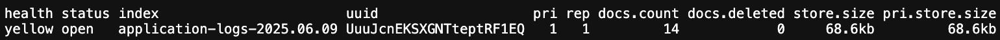

# Elasticsearch 상태


## 
|항목|예시 값|설명|
|-|-|-|
|health|yellow|primary shard는 정상, replica shard는 미할당 (싱글 노드 환경에서 일반적)|
|status|open|인덱스가 열려 있고 읽기/쓰기 가능|
|index|application-logs-2025.06.09|로그 수집 시 자동 생성된 날짜 기반 인덱스|
|uuid|UuuJcnEKSXGNTteptRF1EQ|인덱스 고유 식별자|
|pri|1|primary shard 수|
|rep|1|replica shard 수 (현재 할당되지 않음)|
|docs.count|14|색인된 문서 수|
|docs.deleted|0|논리적으로 삭제된 문서 수 (Lucene 기준)|
|store.size|68.6kb|전체 샤드(복제 포함)의 디스크 사용량|
|pri.store.size|68.6kb|primary shard 기준 디스크 사용량|

# Elasticsearch 공식 문서
> https://www.elastic.co/guide/en/elasticsearch/reference/8.18/getting-started.html

## 조회 방법
- URL로 조회
```
http://localhost:9200/application-logs-2025.06.09/_search
```

# Elasticsearch Heads, Chrome에 추가
> https://chromewebstore.google.com/detail/multi-elasticsearch-heads/cpmmilfkofbeimbmgiclohpodggeheim?hl=ko&pli=1

### LOG 레벨 우선순위
- `logback.xml` 파일보다, `application.yml` 파일의 우선순위가 더 높다.

